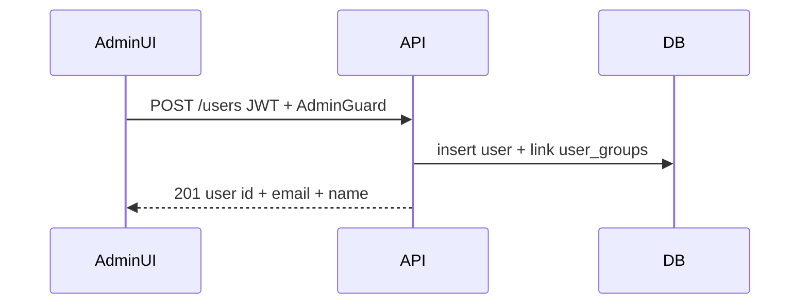

# Admin-only user creation (remove public register)

## Current behavior

- Public `POST /auth/register` in [`apps/backend/src/modules/auth/auth.controller.ts`](../../apps/backend/src/modules/auth/auth.controller.ts) creates users with no group.
- Frontend: [`apps/frontend/app/pages/register.vue`](../../apps/frontend/app/pages/register.vue), [`useAuth.register`](../../apps/frontend/app/composables/useAuth.ts), link from [`login.vue`](../../apps/frontend/app/pages/login.vue), and [`auth` middleware](../../apps/frontend/app/middleware/auth.ts) allow unauthenticated access to `/register`.
- Admin UI pattern: [`apps/frontend/app/pages/admin/groups.vue`](../../apps/frontend/app/pages/admin/groups.vue) uses `definePageMeta({ middleware: ['auth'], ... })`, `fetchMe()`, then redirects non-admins to `/folders`. [`AppHeader.vue`](../../apps/frontend/app/components/file-manager/AppHeader.vue) already shows admin links for folders and groups.

## Target behavior

1. **No public registration**: Remove `POST /auth/register` and all frontend register routes/links.
2. **Admin create user**: Authenticated admin calls a new endpoint with `name`, `email`, `password`, and **`groupIds`** (non-empty array of UUIDs). Server creates the user (hashed password, same rules as today’s register) and adds them to **each** distinct group (dedupe IDs client- or server-side), using the same ManyToMany join as [`GroupsService.assignUser`](../../apps/backend/src/modules/groups/groups.service.ts). **At least one group is required** (no “user with zero groups” from this form).

## Backend changes

| Area | Action |
|------|--------|
| [`auth.controller.ts`](../../apps/backend/src/modules/auth/auth.controller.ts) | Remove `register` route and `RegisterDto` import. |
| [`auth.service.ts`](../../apps/backend/src/modules/auth/auth.service.ts) | Remove `register` method and `RegisterDto` import (keep `login` unchanged). |
| [`users.module.ts`](../../apps/backend/src/modules/users/users.module.ts) | Import `TypeOrmModule.forFeature([User, Group])`, register `UsersService`. |
| New `users.service.ts` | `createUser(dto)`: `ConflictException` if email exists; `bcrypt.hash` like current register; save `User`; for each **unique** `groupId`, load `Group` with `users`, append user if not present, save (reuse assign semantics); `404` if any group id missing. Prefer a single transaction if straightforward. Return `{ id, email, name }` (no password). |
| New `dto/create-user.dto.ts` | `email`, `name`, `password` (same validation as [`register.dto.ts`](../../apps/backend/src/modules/auth/dto/register.dto.ts)), `groupIds`: `string[]` with `@IsArray()`, `@ArrayMinSize(1)`, each element `@IsUUID()`. |
| [`users.controller.ts`](../../apps/backend/src/modules/users/users.controller.ts) | `POST ''` with `@UseGuards(AdminGuard)`, `@Body() dto`, delegate to `UsersService`. Keep `GET me` as-is. |
| Optional cleanup | Delete [`register.dto.ts`](../../apps/backend/src/modules/auth/dto/register.dto.ts) if unused. |

**Note:** Global [`JwtAuthGuard`](../../apps/backend/src/modules/auth/jwt-auth.guard.ts) already applies; [`AdminGuard`](../../apps/backend/src/common/admin.guard.ts) ensures only users in the **Admin** group can call `POST /users`.

## Frontend changes

| Area | Action |
|------|--------|
| Remove [`register.vue`](../../apps/frontend/app/pages/register.vue) | Delete file. |
| [`auth.ts` middleware](../../apps/frontend/app/middleware/auth.ts) | Remove `/register` from the public path allowlist (only `/login` stays). |
| [`login.vue`](../../apps/frontend/app/pages/login.vue) | Remove the “No account? Create account” block linking to `/register`. |
| [`useAuth.ts`](../../apps/frontend/app/composables/useAuth.ts) | Remove `register` function and export. |
| New `pages/admin/users.vue` | Same admin gate as `groups.vue`: `fetchMe()`, redirect if not `Admin`. Form: name, email, password, **multi-select groups** from `GET /groups` (checkbox list or equivalent); client validation requires **at least one** group. Submit `POST /users` with `{ groupIds: [...] }` via `$apiFetch`. Show success/error toast or inline message. |
| [`AppHeader.vue`](../../apps/frontend/app/components/file-manager/AppHeader.vue) | Add an admin nav link (e.g. “Users”) to `/admin/users`, consistent with existing “Groups” / “Admin folders” links. |

## Verification

- Run backend unit/e2e if present; manually verify: non-admin JWT → `403` on `POST /users`; unauthenticated → `401`; admin → `201` and user appears in **all** selected groups; empty `groupIds` or invalid UUID rejected (`400`).
- Frontend: `/register` 404s; login has no register link; admin sees Users page and can create a user; non-admin cannot open `/admin/users` (redirect).

## Docs (optional)

- If you maintain API docs in [`README.md`](../../README.md), replace the public register row with `POST /users` (admin, JWT) — only if you want the table updated in the same change.
