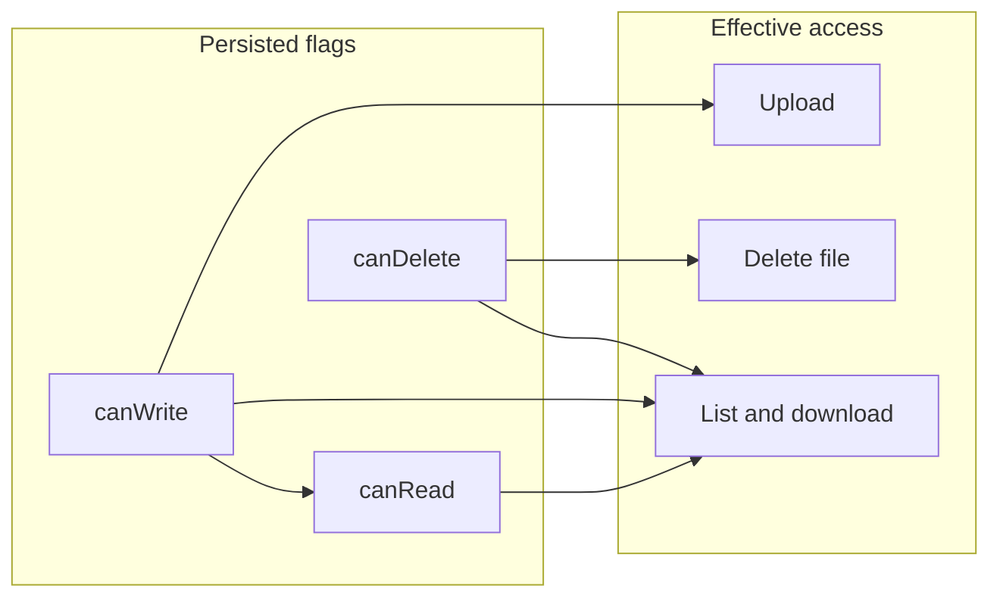

# Group folder permissions (read / edit / delete)

## Current behavior (gaps)

- [`folder-permission.entity.ts`](apps/backend/src/modules/folders/entities/folder-permission.entity.ts) stores `canRead`, `canWrite`, `canDelete` independently.
- [`files.service.ts`](apps/backend/src/modules/files/files.service.ts) already maps list + download to `canRead`, upload to `canWrite`, delete to `canDelete` — but **edit does not imply read** in storage or queries, and **folder listing** only grants access when `canRead` is true ([`folders.service.ts`](apps/backend/src/modules/folders/folders.service.ts) lines 40–48, 124–128).
- Frontend shows **Upload** whenever a folder is open ([`Toolbar.vue`](apps/frontend/app/components/file-manager/Toolbar.vue)) and **Delete** on every file ([`ItemGrid.vue`](apps/frontend/app/components/file-manager/ItemGrid.vue)) with no permission gating.

## Target semantics

| Capability | Meaning |
|------------|---------|
| **Read** | List folder contents + download only (`canRead` true, `canWrite` false). |
| **Edit** | Upload + list + download. Stored as `canWrite`; **server sets `canRead = true` whenever `canWrite` is true**. |
| **Delete** | May call file delete. Stored as `canDelete`. |

**Folder visibility** (sidebar + `GET /folders/:id`): user sees the folder if any of their groups has `canRead`, `canWrite`, or `canDelete` (so delete-only can still open the folder and see files to delete).

**View contents** (list files + download): allow if `canRead OR canWrite OR canDelete` (same as folder visibility for non-owner/non-admin).

**Upload**: `canWrite` only (unchanged).

**Delete file**: `canDelete` only (unchanged).

API field names stay **`canRead` / `canWrite` / `canDelete`** to avoid a breaking migration; UI labels become **Read / Edit / Delete** (`canWrite` → “Edit”).

## Backend changes

1. **Normalize on write** in [`folders.service.ts`](apps/backend/src/modules/folders/folders.service.ts):
   - In `upsertPermission`, after applying DTO: if `canWrite` is true, set `canRead = true` before `save`.
   - In `create`, when saving `dto.permissions`, same normalization per row.

2. **Folder discovery and open** in `FoldersService`:
   - `listForUser`: replace `permission.canRead = true` with  
     `(permission.canRead = true OR permission.canWrite = true OR permission.canDelete = true)`.
   - `getByIdForUser`: replace the `permissions.some(... canRead ...)` check with the same OR condition for the user’s groups.

3. **Files read path** in [`files.service.ts`](apps/backend/src/modules/files/files.service.ts):
   - Add a private helper (e.g. `assertCanViewFolderContents`) that passes when any matching group permission has `canRead OR canWrite OR canDelete` (same OR as above). Use it for **`list`** and **`downloadRequest`** instead of the current `assertCanRead` query that only checks `canRead`.
   - Keep **`uploadRequest` / `create`** on `assertCanWrite` (still only `canWrite`).
   - Keep **`delete`** on `assertCanDelete`.

Implementation note: either extend `assertPermission` with a new mode (e.g. `'canView'`) that runs a query with `(canRead OR canWrite OR canDelete)`, or add a dedicated query method — avoid duplicating the OR logic in three places by centralizing it in one private method.

## Frontend changes

1. **[`PermissionsModal.vue`](apps/frontend/app/components/file-manager/PermissionsModal.vue)**  
   - Rename column **Write → Edit**; help text: explain that Edit includes read/list/download, Delete is separate.
   - **Sync checkboxes**: when `canWrite` is turned on, set `canRead` true; when `canRead` is turned off, set `canWrite` false (so “edit implies read” is visible and consistent before save).

2. **[`admin/folders.vue`](apps/frontend/app/pages/admin/folders.vue)**  
   - Same labels + same two-way sync if it exposes the same toggles.

3. **Effective capabilities** on [`folders/index.vue`](apps/frontend/app/pages/folders/index.vue) (or a tiny composable):
   - **Admin / folder owner**: treat as full access (upload + delete), matching backend bypass.
   - Otherwise derive from `folderDetail.permissions` where `permission.group.name` is in `user.groups`:  
     `canUpload = some(canWrite)`, `canDeleteFile = some(canDelete)` (read is implied when upload is true).

4. **[`Toolbar.vue`](apps/frontend/app/components/file-manager/Toolbar.vue)**  
   - Add prop e.g. `canUpload` (default `true` for backward compatibility if omitted). Show the Upload control only when `hasFolderOpen && canUpload`.

5. **[`ItemGrid.vue`](apps/frontend/app/components/file-manager/ItemGrid.vue)**  
   - Add prop e.g. `showDeleteButtons` (or `canDelete`) default `true`. Hide the delete button when false (download remains).

6. Wire props from `folders/index.vue` using the computed effective permissions.

## Verification

- Run backend build/tests (e.g. `npm run build` / `test` in `apps/backend`) and a quick manual pass: read-only group → list + download OK, upload/delete 403 and UI hidden; edit → upload OK; delete flag → delete OK, read-only still cannot delete.

No DB migration required (same columns; behavior + normalization only).
